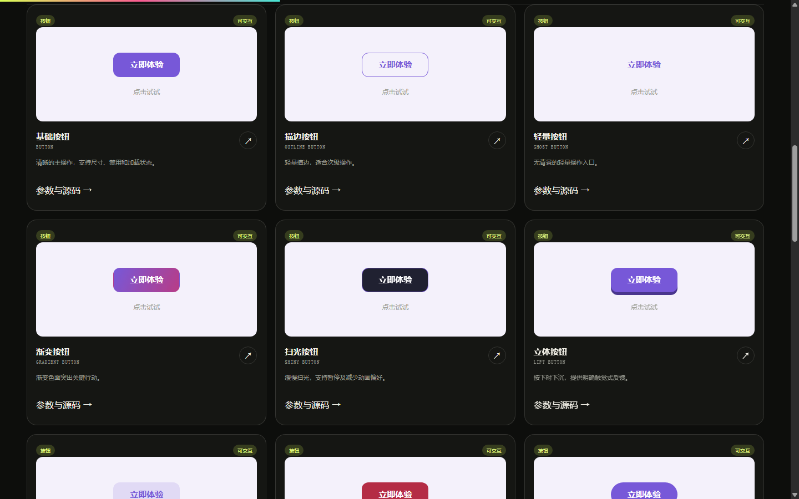
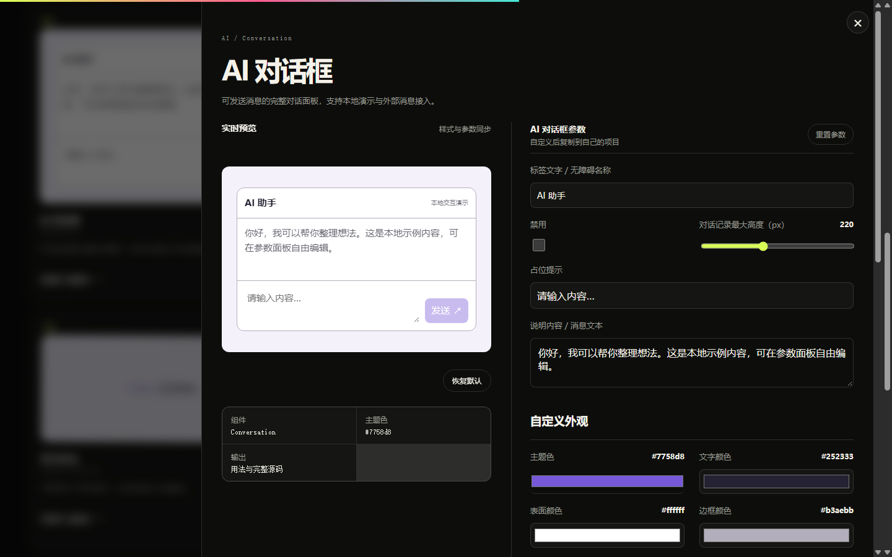
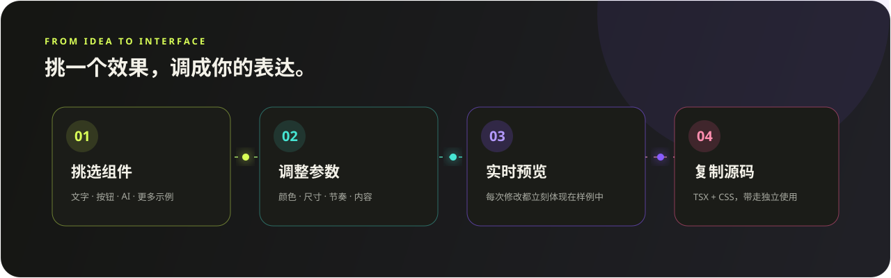

# 字场 ZICHANG

> 为中文界面而生的交互组件库。

字场是一套使用 React、TypeScript 和 CSS 构建的文字、按钮、表单与反馈组件库及展示站。它提供真实交互、可实时调节的预览、完整源码复制，以及对“减少动态效果”偏好的支持。

<p align="center">
  <a href="public/docs/images/zichang-hero.png"></a>
</p>

<p align="center"><b>动态效果现场预览 · 组件分类与完整源码可在浏览器中直接体验</b></p>

| 86 个交互示例 | 实时调参与完整源码 | 选择 · 调节 · 预览 · 复制 |
| --- | --- | --- |
|  |  |  |

## 三步上手


当前版本为 `0.1.0`，适合本地体验与继续开发。组件 Registry 已预留，但尚未发布到 npm 或公共 shadcn Registry。

## 功能

- 48 种可直接运行的文字效果
- 顶层分类：文字、按钮、表单、导航、展示、反馈、AI；文字保留四个二级筛选
- 18 种按钮样式，中英双语选项，支持尺寸、加载、禁用、暂停和动画时长
- 独立输入框、多行输入、选择器、复选框、滑块、开关、标签页、徽章、卡片、折叠面板、提示、进度、加载指示和骨架屏
- 通用组件支持颜色、圆角、字号、间距等自定义；预览、输入状态与真实源码同步
- AI 对话框、聊天气泡、消息输入、思考状态、建议提示词、过程摘要，支持本地交互与源码复制
- 共 86 种目录示例；38 个 Registry 条目、36 个独立组件的本地源码分发
- [AI 组件与详情布局修复](docs/AI_COMPONENTS.md)
- [调研来源与自定义说明](docs/UI_RESEARCH.md)，浏览器验证：`npm run test:ui`
- 每张卡片明确标注触发方式，出现动画可单独重播，互动效果悬停整张卡片即可预览
- 自定义预览文字、字号与动画速度
- 效果暂停、重播、搜索和深浅主题
- 统一且有完整类型定义的 `TextEffect` 组件
- 使用 `Intl.Segmenter` 处理中文、emoji 和组合字符
- 自动响应 `prefers-reduced-motion`
- 响应式首页和独立使用文档
- 服务端渲染与组件清单自动化测试
- shadcn Registry 基础描述
- 独立 `GlitchText` / `MagnetText`，包含固定预览、专属参数与实际 TSX/CSS 完整源码
- 互动效果支持键盘聚焦、持续触发、锁定效果及暂停；磁吸在字距变化时保持占位宽度

## 内置效果

| ID | 中文名称 | 类型 | 适合场景 |
| --- | --- | --- | --- |
| `gradient` | 流光渐变 | 基础 | 品牌标题、重点文字 |
| `outline` | 轮廓描边 | 基础 | 海报、超大标题 |
| `highlight` | 手绘高亮 | 基础 | 重点词、教学内容 |
| `slide` | 逐字滑入 | 进入 | 首屏标题、章节标题 |
| `blur` | 模糊显现 | 进入 | 编辑风格、氛围标题 |
| `scale` | 弹性入场 | 进入 | 短标题、状态反馈 |
| `typewriter` | 打字机 | 循环 | 介绍语、关键词轮播 |
| `shimmer` | 金属扫光 | 循环 | 产品卖点、特殊状态 |
| `wave` | 字符波浪 | 循环 | 活泼标题、活动页面 |
| `glitch` | 信号故障 | 互动 | 科技、游戏风格界面 |
| `magnet` | 字距磁吸 | 互动 | 导航、按钮和标题悬停 |
| `underline` | 灵动下划线 | 互动 | 链接与强调文字 |
| `neon` | 霓虹灯牌 | 基础 | 夜间主题、活动标题 |
| `rainbow` | 彩虹流体 | 基础 | 品牌与节日标题 |
| `longshadow` | 长投影 | 基础 | 海报与复古标题 |
| `cutout` | 纸张镂空 | 基础 | 编辑设计与纸张质感 |
| `fade` | 逐字淡入 | 进入 | 正文标题、章节开场 |
| `flip` | 卡片翻入 | 进入 | 数字与短标题 |
| `rotate` | 旋转落位 | 进入 | 活动标题与强调语 |
| `mask` | 遮罩揭示 | 进入 | 首屏与品牌标题 |
| `pulse` | 呼吸脉冲 | 循环 | 状态提示与焦点文字 |
| `flicker` | 胶片闪烁 | 循环 | 复古与氛围标题 |
| `stretch` | 字形伸展 | 循环 | 音乐、潮流与实验排版 |
| `tilt` | 悬停倾斜 | 互动 | 导航与可点击标题 |

## 技术栈

- React 19
- TypeScript 5
- Tailwind CSS 4
- vinext / Vite
- Cloudflare Worker 兼容构建
- Node.js 原生测试运行器
- ESLint

## 环境要求

- Node.js `>= 22.13.0`
- npm

## 本地运行

克隆项目后进入项目目录：

```bash
npm install
npm run dev
```

打开以下地址：

- 效果库：<http://localhost:3000>
- 使用文档：<http://localhost:3000/docs>

如果 `3000` 端口已被占用，请以终端显示的 `Local` 地址为准。

Windows PowerShell 如果限制执行 `npm.ps1`，可以使用：

```powershell
npm.cmd install
npm.cmd run dev
```

## 本地互动验证

```bash
npm run lint
npm test
npm run check:registry
npm run build:distribution
npm run check:bundles
npm run test:interaction-css
npm run test:typewriter
```

最后两项需要本机 Chromium 浏览器；Windows 自动查找 Chrome 或 Edge，其他路径可通过 `TEXT_EFFECT_TEST_BROWSER` 指定。它们使用独立临时配置以无界面方式验证键盘聚焦、布局宽度、完整 emoji、暂停、减少动态效果和计时器清理，不连接外部服务。

信号故障和字距磁吸的完整源码可在对应工作台复制，按文件标注拆为组件、CSS 和示例三个文件。具体 API 和限制见本地 `/docs`。磁吸适合单行短标题，长文本需预留空间。

## 组件用法

```tsx
import { TextEffect } from "@/components/text-effects";

export function Example() {
  return (
    <TextEffect as="h2" effect="slide" duration={1.4}>
      让文字动起来
    </TextEffect>
  );
}
```

切换效果只需要修改 `effect`：

```tsx
<TextEffect effect="gradient">流光渐变</TextEffect>
<TextEffect effect="typewriter" duration={2.4}>正在输入...</TextEffect>
<TextEffect effect="wave" paused={false}>你好，世界 👋</TextEffect>
```

### 可自定义手绘高亮

手绘高亮已经拆成可独立使用的组件，可控制条带颜色、厚度、覆盖范围、位置、角度、圆角和绘制方向：

```tsx
import { HighlightText } from "@/components/text-effects";
import "@/components/text-effects/highlight-text/highlight-text.css";

<HighlightText
  bandColor="#ff5b91"
  bandThickness={42}
  bandStart={6}
  bandEnd={2}
  bandOffset={5}
  bandAngle={-7}
  bandRadius={4}
  direction="left"
  duration={1.4}
>
  让文字动起来
</HighlightText>
```

在效果库点击“手绘高亮”，可以实时调整这些参数，并复制 React 用法、完整 TSX + CSS 或纯 HTML + CSS。

同样支持完整参数工作台和三种代码输出的效果还有：

- `GradientText`：三段颜色、渐变角度、流动范围、方向和速度
- `OutlineText`：描边颜色、宽度、填充色、阴影颜色与偏移
- `UnderlineText`：线条颜色、粗细、范围、间距、圆角与绘制方向
- `SlideText`：四向滑入、移动距离、逐字间隔、延迟与初始透明度
- `BlurText`：模糊半径、上下方向、移动距离、逐字间隔与延迟
- `ScaleText`：起始缩放、回弹幅度、逐字间隔、延迟与初始透明度
- `TypewriterText`：输入速度、删除速度、停留时间、光标与循环
- `ShimmerText`：基础颜色、高光颜色、扫光角度、宽度与速度
- `WaveText`：振幅、逐字间隔、强调色、方向与速度

进入类组件也可以直接复制使用，例如：

```tsx
import { SlideText } from "@/components/text-effects";
import "@/components/text-effects/slide-text/slide-text.css";

<SlideText direction="left" distance={48} stagger={0.08} duration={0.7}>
  让文字动起来
</SlideText>
```

### TextEffect API

| 属性 | 类型 | 默认值 | 说明 |
| --- | --- | --- | --- |
| `children` | `string` | 必填 | 需要显示的文本 |
| `effect` | `EffectId` | 必填 | 使用的效果 ID |
| `as` | `ElementType` | `"span"` | 输出的 HTML 标签或 React 组件 |
| `duration` | `number` | `1.8` | 动画时长，单位为秒 |
| `delay` | `number` | `0` | 动画开始延迟，单位为秒 |
| `paused` | `boolean` | `false` | 是否暂停动画 |
| `className` | `string` | `""` | 自定义 CSS 类名 |
| `style` | `CSSProperties` | — | 自定义行内样式 |
| `aria-label` | `string` | 文本内容 | 自定义辅助技术标签 |

## 项目结构

```text
zujianku/
├─ app/
│  ├─ docs/page.tsx             # 本地使用文档
│  ├─ globals.css               # 站点和效果样式
│  ├─ layout.tsx
│  └─ page.tsx                  # 效果库首页
├─ components/text-effects/
│  ├─ TextEffect.tsx            # 统一组件实现
│  ├─ catalog.ts                # 效果元数据
│  ├─ highlight-text/           # 可独立分发的手绘高亮组件
│  ├─ gradient-text/            # 可自定义流光渐变
│  ├─ outline-text/             # 可自定义轮廓描边
│  ├─ underline-text/           # 可自定义灵动下划线
│  ├─ slide-text/               # 可自定义逐字滑入
│  ├─ blur-text/                # 可自定义模糊显现
│  ├─ scale-text/               # 可自定义弹性入场
│  ├─ typewriter-text/          # 可自定义打字机
│  ├─ shimmer-text/             # 可自定义金属扫光
│  ├─ wave-text/                # 可自定义字符波浪
│  ├─ index.ts                  # 公共导出
│  ├─ text-effects.css          # 通用效果样式
│  └─ types.ts                  # 类型定义
├─ tests/
│  └─ rendered-html.test.mjs    # SSR、文档和组件一致性测试
├─ registry.json                # shadcn Registry 描述
├─ PROJECT_PLAN.md              # 项目路线图
└─ README.md
```

## 常用命令

| 命令 | 用途 |
| --- | --- |
| `npm run dev` | 启动本地开发服务器 |
| `npm run build` | 创建正式构建并检查路由 |
| `npm run start` | 启动正式构建 |
| `npm test` | 构建并运行自动化测试 |
| `npm run lint` | 执行代码规范检查 |

提交 Pull Request 前建议运行：

```bash
npm run lint
npm test
```

## 无障碍设计

- 逐字效果的视觉字符使用 `aria-hidden="true"`。
- 外层元素保留完整可读文本，避免屏幕阅读器逐字朗读。
- 系统启用“减少动态效果”时，动画会缩短至近乎即时。
- 所有效果在动画不可用时仍保留原始文字内容。
- 互动控件使用原生按钮、输入框和语义化标签。

## Registry 状态

根目录的 [`registry.json`](./registry.json) 包含通用组件、15 个独立组件和 `text-effects` 聚合条目，共 17 项。`npm run build:distribution` 在 `outputs/distribution` 生成带文件内容的 Registry JSON、对应源码 ZIP 与 SHA-256 清单；`npm run check:bundles` 生成按需导入和包体积报告。安装目标使用 `@components/` 保留子目录。全部输出仅在本地，尚未配置公共 Registry URL，也未运行真实 shadcn CLI 安装。详见 [分发说明](./docs/DISTRIBUTION.md)。

公开发布 Registry 前需要：

1. 用真实 shadcn CLI 验证本地安装、样式及目标配置。
2. 再提供可访问地址，并选择版本与兼容性策略。
3. 把 `registry.json` 中的 `homepage` 改为正式站点地址。
4. 验证通过 `shadcn add` 安装后的导入路径和样式。

## 路线图

- [x] 首版展示站与响应式效果库
- [x] 48 种文字效果与 15 个独立组件
- [x] 统一 `TextEffect` API
- [x] 本地文档页和自动化测试
- [x] Registry 基础描述
- [ ] 独立效果详情路由
- [x] 可分发的效果 CSS、实际完整源码和依赖闭包检查
- [ ] shadcn Registry 在线安装
- [ ] npm 包与 tree-shaking
- [ ] 组件交互与视觉回归测试
- [ ] 公开演示站

完整计划参见 [`PROJECT_PLAN.md`](./PROJECT_PLAN.md)。

自定义参数、可复制源码与组件发布的详细改造方案参见 [`CUSTOMIZATION_AND_DISTRIBUTION_PLAN.md`](./CUSTOMIZATION_AND_DISTRIBUTION_PLAN.md)。

## 贡献

欢迎提交效果建议、错误报告和代码改进。开始前请阅读 [`CONTRIBUTING.md`](./CONTRIBUTING.md)。

## 安全问题

请不要在公开 Issue 中提交可能影响使用者安全的问题，处理方式见 [`SECURITY.md`](./SECURITY.md)。

## 许可证

仓库目前尚未加入开源许可证。在正式公开前，维护者需要选择并添加许可证；未添加许可证时，默认不代表允许他人复制、修改或再分发代码。
